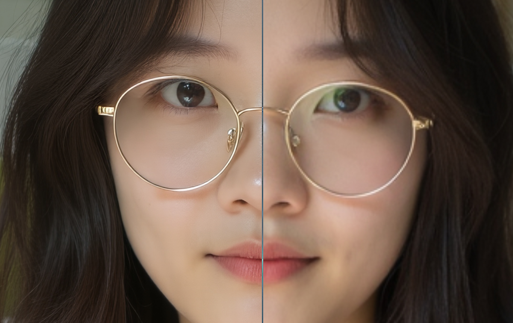

# Kontext HiRes

This model is a LoRA fine-tune of `black-forest-labs/FLUX.1-Kontext-dev` to enhance image details and high resolution.    

## Uses
* Download the lora file from [https://huggingface.co/chflame163/kontext_hires](https://huggingface.co/chflame163/kontext_hires/resolve/main/kontext_hires-25620.safetensors?download=true) and copy it to  `ComfyUI/models/loras/kontext` directory,
* Load the workflow file `kontext_hires_example.json` in ComfyUI and run it.    

The model works best when using the prompt: **"high quality, detailed,"**.

## Attention
This lora is trained to enhance high resolution details while faithfully preserving all subtle features of the original image. Therefore, the subject of the image should have basic clarity, and excessive blurriness will be considered out focus and maintained blur. Similarly, flaws in the image, such as noticeable noise, will not be fixed and will still faithfully high resolution.

